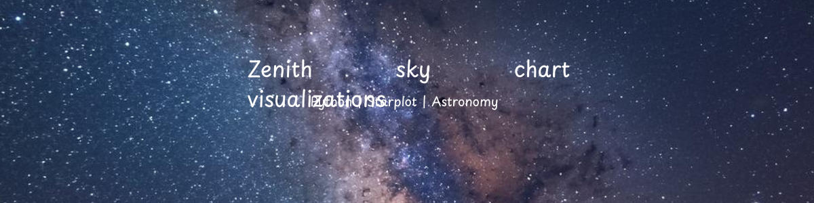

# Five Skies: A Global Zenith Sky Visualization Project 🌌

This project uses Python and the Starplot library to generate zenith sky charts for five different locations and times. Each chart shows the stars directly overhead at that moment, revealing how the night sky changes across hemispheres, seasons, and time zones.

## 🌍 Locations & Times

- New York — Jan 17, 2026 — 9 PM EST  
- Sydney — Jan 17, 2026 — 9 PM AEDT  
- Tokyo — Jan 17, 2026 — 9 PM JST  
- New York — Jun 17, 2026 — 9 PM EDT  
- London — Jan 17, 2026 — 6 PM GMT  

## 🧠 What This Project Demonstrates

- How the sky changes between hemispheres  
- Seasonal differences in visible constellations  
- Time zone effects on star visibility  
- Data-driven visualization using astronomical catalogs  
- Automated labeling and image enhancement with Python  

## 🛠️ Tools Used

- Python  
- Starplot  
- Pillow (PIL)  
- Google Colab  

## 📸 Outputs

All labeled sky charts are available in the `/images` folder.

## 🚀 📓 [View the notebook](notebook/FiveSkies.ipynb)

